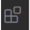
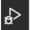

#  ProfileScreenTest

* Standard compliant React Native App Utilizing [Ignite](https://github.com/infinitered/ignite)

## Download Repository

1. Fork github repo into your account
2. clone your fork into desire path
3. cd into project directory

## How to Run App with VSCode

1. Open application with [VSCode](https://code.visualstudio.com/download)
  * If you have never run react-native through VSCode you will also need to download React Native Tools.  Open the Extension Tab  in VSCode and type React Native Tools in the search bar.  Select React Native Tools and then press the install button on the page.
2. Select the Run Tab  on the far left
3. Open up the Terminal tab on the bottom panel
4. Install packages with [NPM](https://www.npmjs.com/get-npm) : `npm install` 
  * for iOS:   `cd ios; pod install; cd ..`
5. With the Run tab  selected, go to the top left of the page and select the debug script. 
  * for iOS: Debug iOS
  * for Android: Debug Android
6. Run application by hitting the play button next to the debug script you just selected.

## Project
Copy this screen to the best of your abilities in the ProfileScreen.js file of the project.

#### Instructions

1. Componentize anything with a repeatable format.
2. All prop hardcoded values should be defined in mapStateToProps.
3. Actual image/icons are not necessary, but an image/icon should be provided. [React-Native-Vector-Icons](https://github.com/oblador/react-native-vector-icons) library is already included in application.
4. No Navigation is necessary.  Any button that navigates should create an alert that tells where it navigates to.
5. "Learn More" and "All Activities" buttons should show a view with made up information and then hide the view when the button is pressed again.
6. Bonus Points for adding navigation/animation/redux etc.

## Submission

Once you have completed the project email us your forked github repo url.
